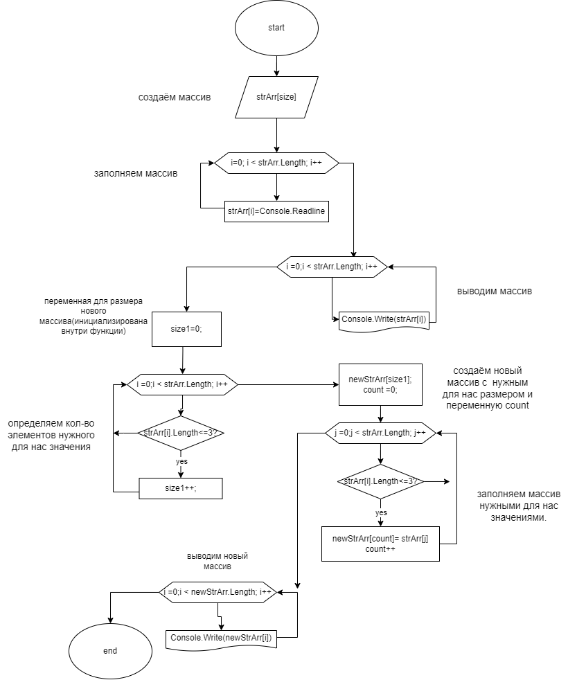

# Текстовое описание решения задачи
* _Задача: Написать программу, которая из имеющегося массива строк формирует 
новый массив из строк, длина которых меньше, либо равна 3 символам. Первоначальный массив можно ввести с клавиатуры, либо задать на старте выполнения алгоритма. При решении не рекомендуется пользоваться коллекциями, лучше обойтись исключительно массивами._

Примеры:
```
[“Hello”, “2”, “world”, “:-)”] → [“2”, “:-)”]
[“1234”, “1567”, “-2”, “computer science”] → [“-2”]
[“Russia”, “Denmark”, “Kazan”] → [] 
```
### блоксхема:

## [код](Program.cs)
## 1. Cоздание массива

В этой программе я осуществлял ввод массива от пользователя. поэтому первым делом обратимся к нему для ввода размера массива.
```c#
Console.Write("Введите длинну массива: ");
```
после этого мы создаём переменную `size`, и присваеваем ей размер введенный пользователем.
``` c#
int size = Convert.ToInt32(Console.ReadLine());
```
после создаём массив и присваиваем ему размер
```c#
string[] strArray = new string[size];
```

## 2. Заполнение массива

Заполнение массива тоже будет осуществлять пользователь. Для этого мы создаём функцию(метод) `FillingArray`,тип функции будет `void`, а принимает массив типа `string` :
```c#
void FillingArray(string[] str)
```
внутри функции(метода) используем цикл `for`. переменная `i` будет рости пока меньше длинны массива. внутри цикла каждому значению массива под индексом `i` присваеваем значение. так же перед этим выведем на экран что мы хотим от пользователя:
```c#
for (int i = 0; i < str.Length; i++)
    {   
        Console.WriteLine($"Введите {i+1} элемент: ");
        str[i] = Console.ReadLine();
    }
```
для работы метода(функции) реализуем его призыв
```c#
FillingArray(strArray);
```
## 3. Вывод массива на экран 

Для вывода массива так же реализуем функцию. назовем её `PrintArray`, тип будет`void`, принимать будет так же наш массив типа `string`.
```c#
void PrintArray(string[] str)
```
Воспользуемся функцией for по тому же методу. только вместо ввода мы будет  выводить данные (для болеее эстетичного вывода чуть усложнили функцию) :
```c#
   Console.Write("[");
    for (int i = 0; i < str.Length; i++)
    {
        if (i<str.Length-1)
        {
            Console.Write($"{str[i]}, ");
        }
        else
        {
            Console.Write(str[i]);
        }
    }
    Console.WriteLine("]");
```

Для работы так же реальзуем вызов:
```c#
PrintArray(strArray);
```
##  Создание массива с нужным для нас элементами
Для реализации создадим функцию(метод) `NewArrayLessThan3char` , который имеет тип `string[]` , и принимает на вход массив типа `string`
```c#
string[] NewArrayLessThan3char(string[] str)
```
Внутри функции создаём переменные `size` и `count` и присваеваем им значение 0 :
```c#
    int size = 0;
    int count = 0;
```
После создаём цикл `for` внутри которого реализуем условие. Если `str[i].Length <= 3` то переменной `size` прибавляем единицу :
```c#
 for (int i = 0; i < str.Length; i++)
    {
        if(str[i].Length <= 3)
        {
            size++;
        }
    }
```
Далее создаём массив `newStrArr` и присваеваем ему размер `size`
```c#
    string[] newStrArray = new string[size];
```

Создаём еще один цикл `for` (i заменили на j).
Внутри цикла реализуем условие `str[j].Length <= 3` то `newStrArray[Count]` присваеваем значение `str[j]`, а элементу `count`прибавляем единицу :
```c#
    for (int j = 0; j < str.Length; j++)
    {
        if(str[j].Length <= 3)
        {
            newStrArray[count] = str[j];
            count++;
        }
    }
```
Обязательно возвращаем массив `newStrArray` :
```c#
    return newStrArray;
```

Реализуем вызов функции. Для начала созаём массив типа `string` и присваиваем ему значения функции(метода) :
```c#
string[] newArrResult = NewArrayLessThan3char(strArray);
```
## 4. Вывод результата 
Для этого воспользуемся уже написанной функцией `PrintArray` только вместо старого массива будет принимать уже новый :
```c#
PrintArray(newArrResult);
```